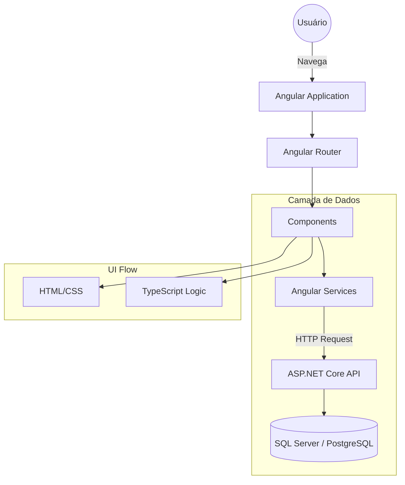

# ProductShop (Frontend)

Interface de e-commerce moderna e escalável, desenvolvida com Angular, focada em proporcionar uma experiência de compra otimizada e de alta performance.

---

## 📖 Sobre o Projeto

O ProductShop é a camada de apresentação de um sistema de vendas online. O projeto foi idealizado para unir a robustez do ecossistema Angular com a eficiência de um backend em ASP.NET Core, resultando em uma loja virtual capaz de lidar com grandes catálogos de produtos e fluxos de checkout complexos.

O objetivo principal é oferecer ao usuário final uma navegação intuitiva, com carregamento rápido de páginas e uma interface limpa, enquanto fornece aos administradores do sistema a facilidade de gerenciar o inventário e as vendas.

O público-alvo são consumidores finais de produtos e gestores de lojas virtuais.

---

## ✨ Funcionalidades

- **Catálogo de Produtos**: Exibição dinâmica de produtos com suporte a filtros e categorias.
- **Fluxo de Compra**: Sistema de adição de itens ao carrinho e processo de checkout simplificado.
- **Interface Responsiva**: Layout adaptável para diferentes tamanhos de tela, garantindo a melhor experiência em dispositivos móveis e desktop.
- **Navegação Estruturada**: Utilização de roteamento avançado do Angular para transições rápidas entre a home, detalhes do produto e carrinho.
- **Validação de Formulários**: Implementação de formulários reativos para garantir a integridade dos dados de entrega e pagamento.
- **Integração com Backend**: Consumo de APIs REST desenvolvidas em C# / ASP.NET Core para persistência de dados e regras de negócio.

---

## 🏗 Arquitetura

A aplicação segue a arquitetura de **Componentes do Angular**, organizando a interface em partes independentes e reutilizáveis, o que facilita a manutenção e a escalabilidade do sistema.



---

## 📂 Estrutura do Projeto

```text
.
├── frontend
│   ├── src
│   │   ├── app            # Componentes, serviços e módulos da aplicação
│   │   ├── assets         # Imagens, ícones e arquivos estáticos
│   │   └── environments   # Configurações de ambiente (dev, prod)
│   ├── angular.json       # Configurações do Angular CLI
│   ├── package.json      # Dependências e scripts de execução
│   └── tsconfig.json      # Configurações do TypeScript
└── README.md              # Documentação do projeto
```

---

## 🛠 Tecnologias Utilizadas

| Tecnologia | Finalidade |
|------------|------------|
| Angular 22 | Framework robusto para construção de SPAs escaláveis |
| TypeScript | Linguagem com tipagem forte para maior segurança do código |
| RxJS | Biblioteca para programação reativa e manipulação de fluxos de dados |
| HTML5 / CSS3 | Estruturação e estilização da interface |
| ASP.NET Core | Framework backend para processamento de requisições (C#) |

---

## 📦 Dependências Principais

- **@angular/core**: O núcleo do framework, provendo a reatividade e a gestão de componentes.
- **@angular/router**: Responsável por gerenciar a navegação entre as páginas da loja.
- **rxjs**: Fundamental para o consumo de APIs assíncronas e manipulação de eventos.
- **tslib**: Biblioteca de suporte para a compilação de TypeScript.

---

## ⚙ Fluxo da Aplicação

Acesso à Loja $\rightarrow$ Exploração de Produtos $\rightarrow$ Seleção de Itens $\rightarrow$ Carrinho $\rightarrow$ Autenticação/Cadastro $\rightarrow$ Finalização de Pedido $\rightarrow$ Confirmação de Compra.

---

## 🚀 Como Executar

### Pré-requisitos

- Node.js instalado
- Angular CLI (`npm install -g @angular/cli`)

---

### Clonando o projeto

```bash
git clone <url-do-repositorio>
cd ProductShop/frontend
```

---

### Instalando dependências

```bash
npm install
```

---

### Executando em modo de desenvolvimento

```bash
npm start
```
A aplicação estará disponível em `http://localhost:4200`.

---

## 🔍 Decisões Arquiteturais

- **Escolha do Angular**: A decisão por utilizar Angular em vez de React foi motivada pela necessidade de uma estrutura mais rígida e opinativa, ideal para sistemas corporativos onde a consistência do código é fundamental.
- **Sincronização com C#**: A arquitetura foi desenhada para que o frontend consuma contratos de API bem definidos em ASP.NET Core, garantindo que a tipagem do TypeScript no front reflita as entidades do backend.
- **Uso de RxJS**: A implementação de fluxos reativos permite que a interface de compra seja atualizada instantaneamente sem a necessidade de recarregar a página.

---

## 💡 Boas Práticas Utilizadas

- **Separação de Serviços**: A lógica de comunicação com a API é isolada em classes de serviço, evitando que os componentes de UI lidem com requisições HTTP.
- **Componentização Atômica**: Divisão da interface em componentes menores e reutilizáveis (ex: cards de produto, botões de compra).
- **Tipagem Forte**: Uso rigoroso de interfaces TypeScript para evitar erros de dados inesperados vindos da API.

---

## 📚 Aprendizados

Ao analisar este projeto, é possível aprender sobre:
- A integração de frontends Angular com backends em .NET Core.
- A implementação de fluxos de e-commerce utilizando roteamento dinâmico.
- O gerenciamento de estados assíncronos com RxJS.
- A construção de interfaces corporativas escaláveis e tipadas.

---

## 👨‍💻 Autor

[Guilherme](https://github.com/guilherme-dev)
